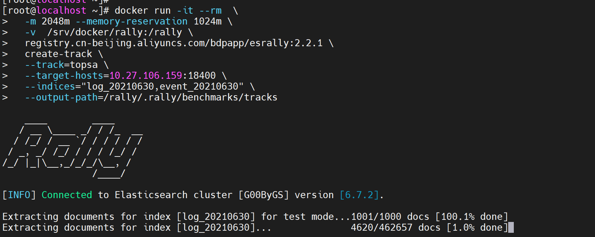

# ES-Rally 对ES的性能测试工具 
> 

## ES的服务启动
> 安装部分省略[](./isoinfo.md)

```bash

/usr/bin/su - es <<- Code
/usr/local/elasticsearch-6.8.18/bin/elasticsearch -d
Code
```

## es-rally 测试本地
```bash

docker run -it --rm  \
  -m 2048m --memory-reservation 1024m \
  -v  /srv/docker/rally:/rally \
  registry.cn-beijing.aliyuncs.com/bdpapp/esrally:2.2.1 \
  list tracks

```

## es-rally 创建本地自己的tracks
> 注意需要导出的es需要网络连通

```bash

## 创建 tracks
docker run -it --rm  \
  -m 2048m --memory-reservation 1024m \
  -v  /srv/docker/rally:/rally \
  registry.cn-beijing.aliyuncs.com/bdpapp/esrally:2.2.1 \
  create-track \
  --track=topsa \
  --target-hosts=10.27.106.159:18400 \
  --indices="log_20210630,event_20210630" \
  --output-path=/rally/.rally/benchmarks/tracks

```


